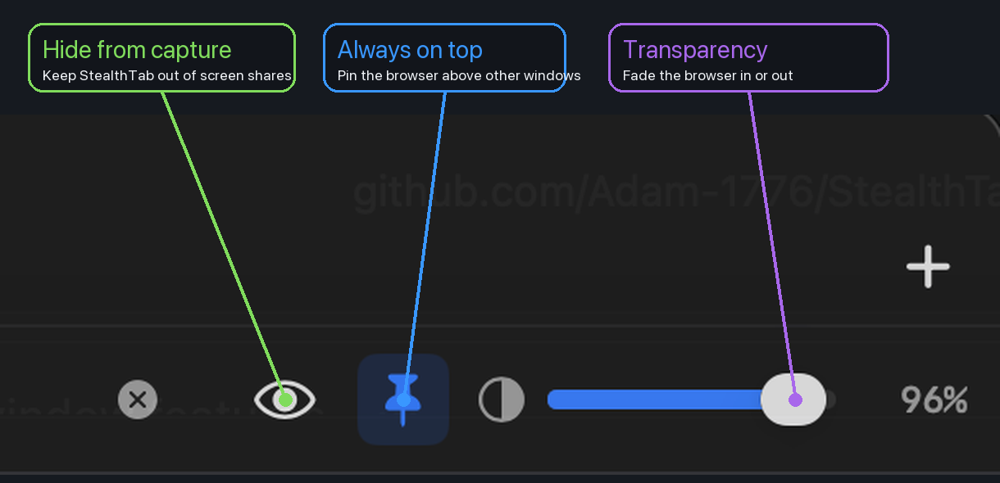

# StealthTab

StealthTab is a macOS browser made for screen sharing. It lets you keep a web page open on your Mac while hiding the browser window from many screen sharing and screen recording apps.

Use it when you want a browser window that can stay private, stay on top, and fade into the background while you work.

## What It Does

- **Hide from screen sharing and recording**: Toggle capture hiding from the toolbar.
- **Keep the browser on top**: Pin the window above normal app windows and full-screen Spaces where macOS allows auxiliary windows.
- **Adjust transparency**: Fade the browser window from subtle to fully opaque.
- **Browse normally**: Use tabs, back/forward, reload, search, and history like a lightweight browser.
- **Stay compact**: The window can shrink down for small reference views.

Screen capture hiding uses macOS window privacy behavior. Apps that respect this system setting should not show the StealthTab window while capture hiding is enabled.

## Controls

| Control | What It Does |
|---------|--------------|
| Eye | Shows or hides StealthTab from screen capture |
| Pin | Keeps the browser window above other windows |
| Opacity slider | Adjusts the window transparency |
| Plus | Opens a new tab |
| X on a tab | Closes that tab |

At narrower window sizes, the opacity slider collapses into a compact icon. Click it to open the opacity slider in a small popover.

When pinned, StealthTab uses macOS overlay-style window behavior so it can remain visible across Spaces. macOS still controls fullscreen window rules, so behavior can vary slightly by app.

## Browsing

| Action | How To |
|--------|--------|
| Open a website or search | Type in the address bar and press Enter |
| Go back or forward | Use the chevron buttons or trackpad gestures |
| Reload or stop loading | Click the reload button |
| Open a new tab | Click plus or press Cmd+T |
| Close a tab | Press Cmd+W |
| Switch tabs | Press Cmd+1 through Cmd+9 |
| Open history | Press Cmd+Y or use History > Show Full History |

## Getting Started

1. Open `StealthTab/StealthTab.xcodeproj` in Xcode.
2. Select your Mac as the run destination.
3. Press Cmd+R to build and launch StealthTab.

The browser opens to Google by default.

## Requirements

- macOS 15.6 or later
- Xcode 17.0 or later

## Notes

StealthTab is designed for privacy during screen sharing, presentations, recordings, and focused work. It is not a security boundary for sensitive secrets, and capture behavior can vary by app.

## Technical Documentation

- [Project Structure](PROJECT_STRUCTURE.md)
- [Code Organization](CODE_ORGANIZATION.md)

## License

See [LICENSE](LICENSE) for details.
